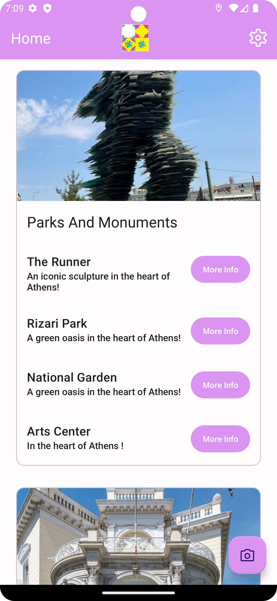
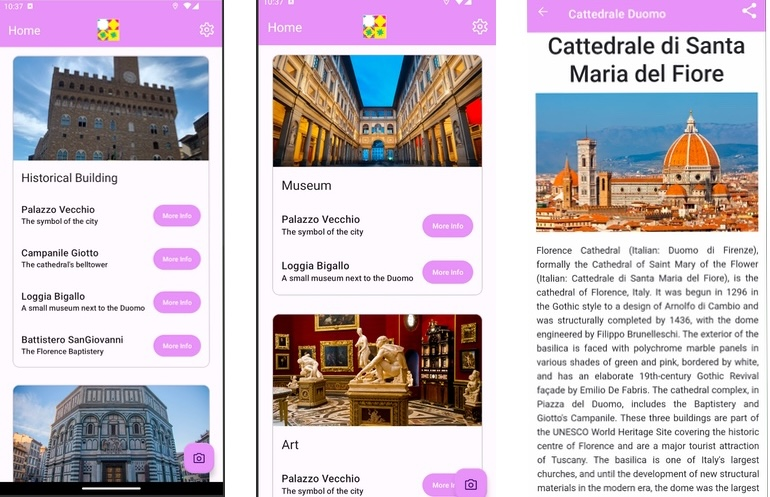

<a name="readme-top"></a>

<!-- PROJECT LOGO -->
<br />
<div align="center">
  

  <p align="center">
    Smart Tourism app for Android Devices
  </p>
</div>

# Getting Started

<div align="center">
  
  &nbsp; &nbsp; &nbsp; &nbsp; &nbsp; &nbsp;
   
</div>

The repository consists of two parts:

* Python (Docker supported)
* Android project

The Python part generates SQLite files from an image dataset and guides folder.  
The Android app uses these databases. Always recompile after Python-side changes.

---

## Monument Guides Creation

- Use the `Python/guides/CITYNAME` folder.
- Duplicate `Template Monument` for each real monument. Name must match dataset folder.
- Use [Markdown format](https://www.markdownguide.org/basic-syntax/) for content.

### Markdown Header Format:

<!-- METADATA <Latitude> <Longitude> <Category1>, <Category2>, <Category3> <Attribute1>, <Attribute2>, <Attribute3>, <Attribute4>, <Attribute5> <Subtitle> <Guide Link> -->


### Languages

- Add language folders (e.g., French, German).
- Keep folder and guide file names consistent.
- Each monument folder must have a guide in every supported language.

### Categories

- In `Python/categories/CITYNAME`, add **one image per category** used in guides.
- Image filenames = category names.

---

## Database Creation
imageDatasets/CITYNAME
├───Monument1
│ img1.jpg
│ ...
├───Monument2
│ ...


### Docker Commands

From the project folder:

    ```sh
    docker build -t tfimage .
    docker run -it tfimage CITYNAME
    docker container ls -all
    docker cp containerID:/app/models/src/main/assets/databases ./models/src/main/assets/

## Or (manual copy):
    ```sh
    ./run_docker.sh CITYNAME
    ./copy_guides.sh CITYNAME

APK Generation
Refer to this guide.
APK output path: app/build/outputs/apk/support/debug

App User Guide
Installation
Install APK from app/build/outputs/apk/support/debug.

Open the app and grant all permissions.

Loading Screen
Shows while data is loaded.

On first launch, select categories and attributes.

Main Screen
Lists monuments by selected categories.

You can modify your preferences in settings.

Camera Recognition
Tap the FAB (bottom right) to scan a monument.

Recognized monuments show a popup with details.

Monument Guides
Each monument has a dedicated guide.

3 recommended monuments also shown.

Tap a monument for its guide or map directions.

Preferences
Accessible from settings.

Allows changes to categories and attributes.

<p align="right">(<a href="#readme-top">back to top</a>)</p>

